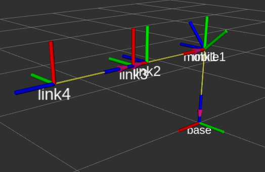

## Steps to run the demo in RViz 
We will be running the visualization DH-parameters in RViz.
* First we will be installing the joint_state_publishers and the ros_control for ros-noetic by the following commands

```
sudo apt-get install -y joint-state-publisher
sudo apt-get install ros-noetic-gazebo-ros-pkgs ros-noetic-gazebo-ros-control
```

*  Run the launch file
```
  roslaunch simulation_dh dh_transformation_visualization.launch    
```

<p align="center">
  
</p>
