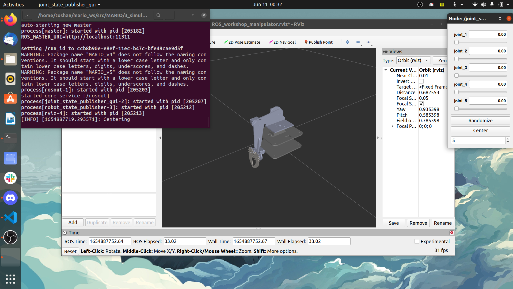

## Steps to run the demo in RViz 
Repo with new URDF of manipulator to visualize in RViz and using command line as well as gui to give input to RViz  

If you have not installed the joint_state_publishers and ros_control for ros-noetic, follow the commands given [here](https://github.com/SRA-VJTI/MARIO/tree/master/2_simulation_dh)

*  Run the launch file
```
  roslaunch simulation_rviz display.launch 
```

<p align="center">
  
</p>


   *  If you come across this error  
Could not find the GUI, install the 'joint_state_publisher_gui' package  
   *  Install  using  
sudo apt install ros-<your_version_of_ros>-joint-state-publisher-gui 
----------------------------------------------------------------------  
  
*  Once you are done with the visualisation with gui , Ctrl+ c to stop this .  
  
  
*  For command line input    

```
roslaunch simulation_rviz mario_rviz.launch    
```
*  Now ,On a different terminal, source ROS again and go to the simulation folder and write the following command

```
rosrun simulation_rviz pub_try1.py  
```
Then initially set all values to zero , to get the default position of the manipulator .  
After this you can now check for different values.
