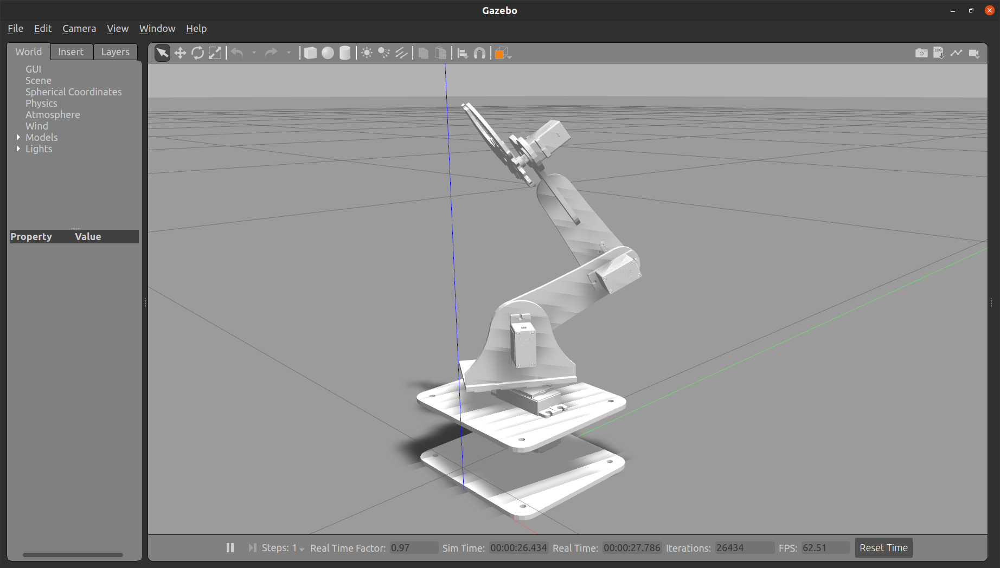
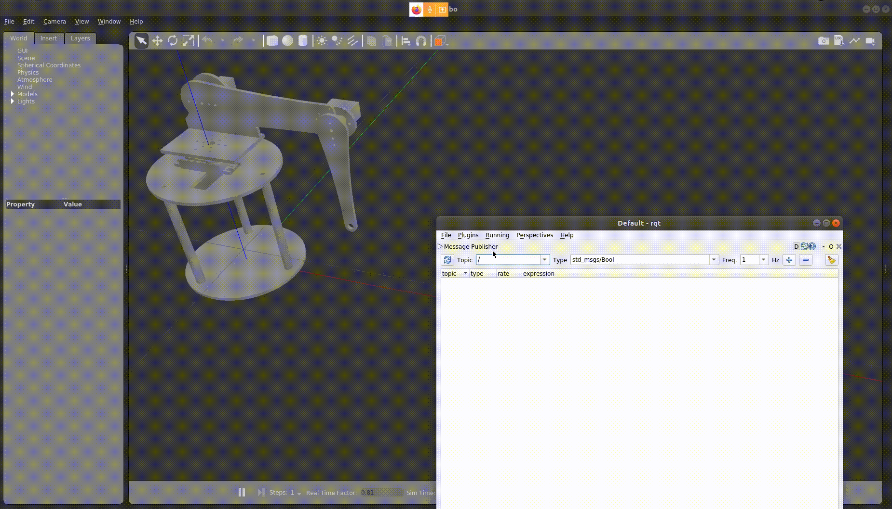
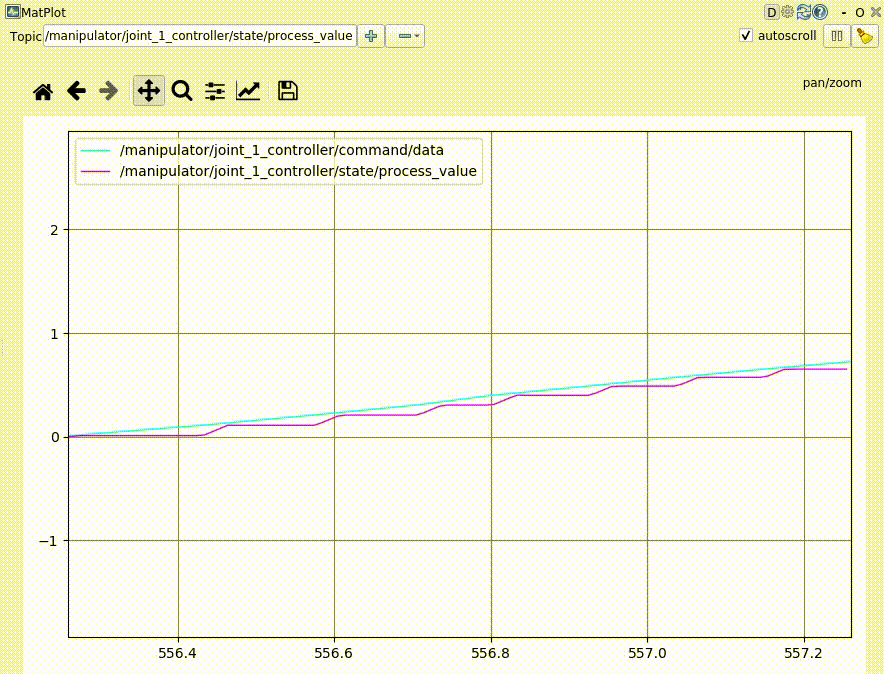

# Table of Contents
* [Steps to run the demo in Gazebo](#steps-to-run-the-demo-in-gazebo) 
* [Using RQT to send commands](#using-rqt-to-send-commands)
* [Steps For Running the Scripts in Gazebo](#steps-for-running-the-scripts-in-gazebo)

## Steps to run the demo in Gazebo
* Gazebo is the simulation tool that is used by ROS. It has a lot of Applications. In this workshop we will be using ROS to simulate the Manipulator. For the running the simulation just follow commands mentioned below.
* If you have not installed the joint_state_publishers and ros_control for ros-noetic, follow the commands given [here](https://github.com/hashmis79/MARIO/tree/master/2_simulation_dh)

*  Run the launch file
```
  roslaunch simulation_gazebo gazebo.launch 
```

<p align="center">
  
</p>

## Using RQT to send commands
In this section we'll go over tools to help you visualize the performance of your controller and tune any gains/parameters the controller might have, particularly PID gains. We'll be using RQT, ROS's plugin-based user interface, so be sure you first have that installed.

Start RQT:

```
rqt
```
### Add a Command Publisher
On the 'Plugins' menu of RQT add the `Topics` --> `Message Publisher` plugin then choose the topic from the drop down box that commands any particular controller that you want to publish to. For the RRBot, add the controller:

```
/manipulator/joint_1_controller/command
```
<p align="center">
  
</p>

Then press the green plus sign button at the top right.

Enable the topic publisher by checking the check box on the left of the topic name. Set the rate column to 20 (the frequency we send it commands - 20hz in this case).

Next, expand the topic so that you see the "data" row. In the expression column, on the data row, try different radian values between joint1's joint limits.

Next, in that same expression box we'll have it automatically change values using a sine wave. Add the following

```
sin(i/10)
```

### Visualize the controller's performance
Add a Plot plugin to RQT and add the same topic as the one you chose above for the topic publisher:

```
/manipulator/joint_1_controller/command/data
```

Click the green add button. You should now see a sine wave being plotted on the screen.

Add another topic to the Plot plugin that tracks the actual position of the actuator being controlled.

```
/manipulator/joint_1_controller/state/process_value
```
<p align="center">
  
</p>

In the graph you can see that the controller is trying to follow the command we have provided it. We have already set the PID values for our bot, but if you want to tune it there is a plugin in RQT. To know more about it visit [this tutorial](http://gazebosim.org/tutorials/?tut=ros_control#TunethePIDgains). 

**Note :** The process value doesn't go lesser than zero because of the limits we have set on the joints which is 0 to pi radians.

### Steps For Running the Scripts in Gazebo
We will be testing out 3 scripts ( Testing.py, forward_kinematics.py, inverse_kinematics.py).

For running the scripts on gazebo, firstly launch gazebo world using the command

```
roslaunch simulation_gazebo gazebo.launch
```

After starting gazebo we will be testing out `Testing.py`. The command for that is :

```
rosrun simulation_gazebo Testing.py
```
Similarly, you can test out the scripts for  `forward_kinematics.py` and `inverse_kinematics.py`
