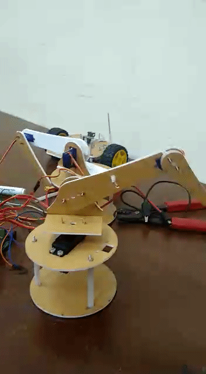

# Servo Sweep

This example describe how to set all three servos at different angles.

## Steps to follow

* Build and Flash the code 
    * ```cd firmware/servo_sweep```
    * ```idf.py build```
    * ```idf.py -p PORT flash```

Note :- If it shows ```cmake flash error```. Run the following commands
* ```sudo chmod 777 PORT```
* ```idf.py -p PORT flash```

## Demo 
